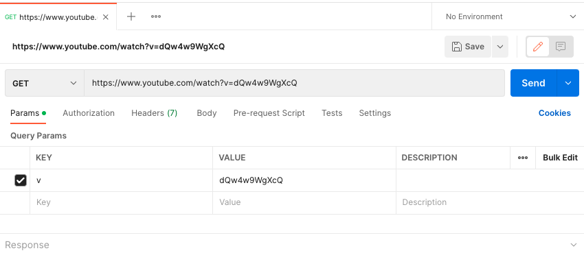
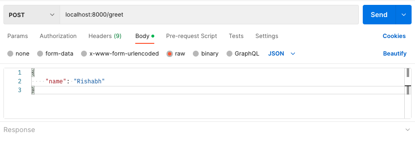
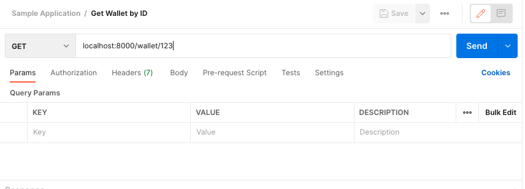

# Lab 2 - Introduction to Flask (Feb 3, 2023)

#### Some useful links before we begin

- [Official Flask Documentation](https://flask.palletsprojects.com/en/2.2.x/)
- [Flask Tutorial by the people who made it](https://flask.palletsprojects.com/en/2.2.x/tutorial/)

<hr />

## What actually happens when you type a URL in your browser?

Before we being talking about Backend and APIs etc, let's first understand a very basic flow of what happens when you actually type a URL in your browser. Say you want to open `www.google.com` in your browser, what does that entail? What exactly happens between the time when you type that URL and press enter till the time you actually see google on your browser screen? Well, let's talk about it on a high level.

1. Your request is sent to a `Domain Name Server` or `DNS`. In simple words, you can think of DNS as a huge dictionary map of `URL => IP Address`. What it does is map your URL which is essentially a string to the IP address at which the `API gateway` or the actual `webserver` lies.

If you remember, there was also a publically available API that your Flask webserver was running on.


2. The DNS then forwards that request to the webserver. This request also includes all additional data that you sent via your browser such as HTTP headers, URL params etc.

3. The webserver now processes the request and prepares the ideal response and the response code.

4. The webserver sends back the response to the browser. This can be a JSON, HTTP or multiple files (for example multiple css, html and js files for a webpage).

5. Your browser takes that data and renders it according to its type.

## Web server

Webserver is nothing but a system that runs on one or multiple files (read as functions) that can handle specific requests. For example, if your webserver is an online calculator, it might respond to add, diff, mult and div functions and send back a `404 (error code for Not found)` for anything else.

A webserver is also used to host websites, databases etc.

Webservers use the `Hypertext Transfer Protocal (HTTP)` to communicate with clients and serve content.

The HTTP protocol allows certain standardized methods of communication and calls that allow `C-create`, `R-read`, `U-update`, `D-delete` operations.

- Create - POST call
- Read - Get call
- Update - Put Call
- Delete - Delete Call

## Application Programming Interface

`Application Programming Interface` or an `API` is a set of protocols through which applications communicate with each other. It defines the way in which two or more pieces of software communicate with each other, enabling them to exchange data or information. APIs can be thought of as a contract between two software systems.

The API defines how the systems will interact, including what data will be exchanged and what actions will be performed. This allows different software systems to be integrated, even if they were built by different developers and using different programming languages and technologies.

There are different kinds/categories of APIs. The most common ones are caled `RESTful APIs` which uses the HTTP protocol and its methods to communicate. The other kinds of APIs are `Simple Object Access Protocol (SOAP)`, `Remote Procedure Call (RPC)`, or you can even make your own custom protocols.

## Flask

Its time to talk about Flask, finally....!

### What is Flask?

Flask is a micro web framework written in Python. It is designed to be a lightweight and easy-to-use framework for building web applications. Flask provides a simple and straightforward way to create and deploy web applications, making it a popular choice for many developers. Flask's modular design allows developers to build applications by adding only the components that are needed, making it a flexible and extensible choice for many use cases.

### Why use it?

Flask is often used for building small to medium-sized web applications, such as single-page apps, microservices, or web APIs. It is also used for prototyping and testing, as it can be set up and running quickly and with minimal overhead. Flask has a large and active community of developers, who have created a wealth of libraries and extensions that can be easily integrated into a Flask application.

### Flask syntax

Let's see an example of a basic CRUD server using Flask and everything that entails!

```
# Import the Flask module
from flask import Flask

# Create a Flask application object
app = Flask(__name__)

# Define a route for the root URL
@app.route("/")
def index():
    return "Welcome to the Flask CRUD server!"

# Define a route for the "create" endpoint
@app.route("/create", methods=["POST"])
def create():
    # Code to create a new resource
    return "Resource created!"

# Define a route for the "read" endpoint
@app.route("/read/<id>", methods=["GET"])
def read(id):
    # Code to retrieve a resource
    return f"Resource with id {id} retrieved!"

# Define a route for the "update" endpoint
@app.route("/update/<id>", methods=["PUT"])
def update(id):
    # Code to update a resource
    return f"Resource with id {id} updated!"

# Define a route for the "delete" endpoint
@app.route("/delete/<id>", methods=["DELETE"])
def delete(id):
    # Code to delete a resource
    return f"Resource with id {id} deleted!"

# Run the application
if __name__ == "__main__":
    app.run(debug=True)
```

At the very beginning of the code, we import the Flask library. If you don't have it installed, you can use the official documentation (link on top) to find steps on how to install Flask.

`app = Flask(__name__)` creates an instance of the Flask class and assigns it to the app variable.

The argument `__name__` passed to the Flask constructor is a special Python variable that provides the name of the current module as a string. When you run a Python script, the `__name__` of the script is set to `__main__`. Flask uses this information to determine if the script is being run as a standalone application or if it is being imported as a module into another application.

When the script is run as a standalone application, Flask enables the development web server, which allows you to test your application locally. When the script is imported as a module into another application, Flask does not enable the development web server and assumes that the application is being run in a production environment.

The `@` symbol is used to define a `decorator` for a Flask route. A decorator is a special type of function in Python that modifies the behavior of another function. In the case of Flask, the decorator is used to associate a function (also known as a view function or handler) with a specific URL route.

```
@app.route("/")
def index():
    return "Welcome to the Flask CRUD server!"
```

In this example, `@app.route("/")` is the decorator that tells Flask that the index() function should handle HTTP requests to the root URL ("/"). When a client (such as a web browser) sends an HTTP request to the root URL, Flask will call the index() function and return the string `"Welcome to the Flask CRUD server!"` as the response.

The HTTP methods that the route can allow are passed as an array as part of the param to the decorator. `@app.route("/create", methods=["POST"])` creates a `/create` route that allows a POST call. You can also have a route with multiple methods. In that case, your input could look like `@app.route("/members", methods=["GET", "POST"])`.

The last important aspect is how to receive data as part of your API call? The three widely-used ways in which you can receive data: `Query Param`, `Request Body` and `URL Parameters`. Let's talk about each of them!

#### `Query Params`

Query parameters are values that are appended to the end of the URL and can be used to pass data to the server.

`https://www.youtube.com/watch?v=dQw4w9WgXcQ`. The `?v=....` is appended to the URL and is used by youtube to get the video associated with that ID. This is called a Query Parameter.

In Flask, you can access query parameters using the request object. For example, you can access the value of the name query parameter as follows:

```
@app.route("/greet")
def greet():
    name = request.args.get("name")
    return f"Hello, {name}"
```

In POSTMAN, this would look something like this: . Do you observe how POSTMAN automatically gets the param?

#### `Request Body`

Request body is the data that is included in the body of an HTTP request. In Flask, you can access the request body using the `request` object. You will need to specify the content type of the request body and parse the data accordingly.

```
@app.route("/create", methods=["POST"])
def create():
    data = request.get_json()
    name = data.get("name")
    return f"Hello, {name}"
```

In POSTMAN, this would look something like this: .

Usually, we use Request Body with POST and PUT calls or when we have to send a large amount of data or data with complex structures. Think form data or a nested data type etc.

### `URL Parameters`

URL parameters are values that are included in the URL as a part of the route. In Flask, you can define URL parameters as part of the route and access them using the `request` object.

`localhost:5050/create/123` is an example of URL Param as the `123` is a part of the overall route itself.

```
@app.route("/greet/<name>")
def greet(name):
    return f"Hello, {name}"
```

In POSTMAN, this call would look something like this! !
